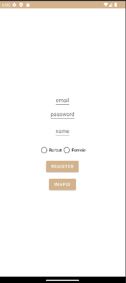
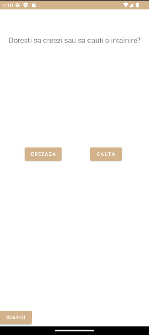
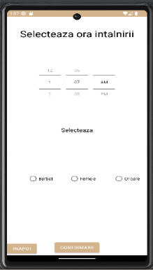
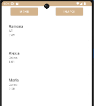

# Hangout Buddy

Hangout Buddy este o aplicație Android pentru organizarea și găsirea de întâlniri bazate pe preferințe de timp, locație și gen, cu stocare și autentificare în Firebase.
<p align="center">
  
  
  
  
</p>

## Funcționalități principale
- **Autentificare utilizatori** (înregistrare și login) prin **Firebase Authentication**.
- **Creare întâlniri** cu:
  - Oră de început.
  - Locație.
  - Descriere.
  - Preferințe de gen pentru participanți.
- **Căutare întâlniri** pe baza:
  - Intervalului orar.
  - Preferințelor de gen.
- **Listare și acceptare invitații**.
- **Vizualizare opțiuni pentru întâlniri acceptate**.
- **Ștergere întâlniri** create sau acceptate.
- **Persistență date** prin **Firebase Realtime Database**.

## Arhitectură și tehnologie
- **Java** (Android).
- **Firebase Authentication** – gestionare conturi utilizatori.
- **Firebase Realtime Database** – stocare date întâlniri și utilizatori.
- **RecyclerView** cu **Adapter** personalizat pentru listarea întâlnirilor.
- **Intents & Bundles** pentru comunicarea între activități.

## Activități principale
- `ChooseLogReg` – ecran inițial pentru alegerea între logare și înregistrare.
- `Registration` – formular de înregistrare cu preferințe.
- `Login` – autentificare utilizator existent.
- `ChoseCreateOrSearch` – alegerea între crearea unei întâlniri sau căutarea uneia.
- `CreeazaIntalnire` – creare întâlnire nouă.
- `TimePick` – setare criterii pentru căutarea unei întâlniri.
- `MatchesActivity` – listă întâlniri disponibile.
- `AcceptMatch` – vizualizare detalii și acceptare întâlnire.
- `MatchesScreen` – listă întâlniri deja acceptate.
- `ShowMatchOptions` – acțiuni pentru o întâlnire (ștergere, mesaje).
- `WaitForMatches` – așteptare participanți la întâlnirea creată.

## Cerințe
- **Android Studio** instalat.
- **Firebase Project** configurat cu:
  - Authentication activat.
  - Realtime Database setată în modul corespunzător.
  - SHA-1/SHA-256 adăugate pentru autentificare.
- Dispozitiv sau emulator cu acces la internet.

## Configurare și rulare
1. Clonează repository-ul:
   ```bash
   git clone https://github.com/<user>/<repo>.git
   ```
2. Deschide proiectul în Android Studio.
3. Încarcă fișierul `google-services.json` din consola Firebase în folderul `app/`.
4. Sincronizează proiectul (**Sync Project with Gradle Files**).
5. Rulează pe emulator sau dispozitiv real.

## Flux de utilizare
1. Utilizatorul alege **Logare** sau **Înregistrare**.
2. Dacă este nou, își creează cont și își setează preferințele.
3. Poate crea o întâlnire sau căuta una.
4. Poate accepta invitații și interacționa cu alți participanți.
5. Poate șterge întâlnirile create sau acceptate.
